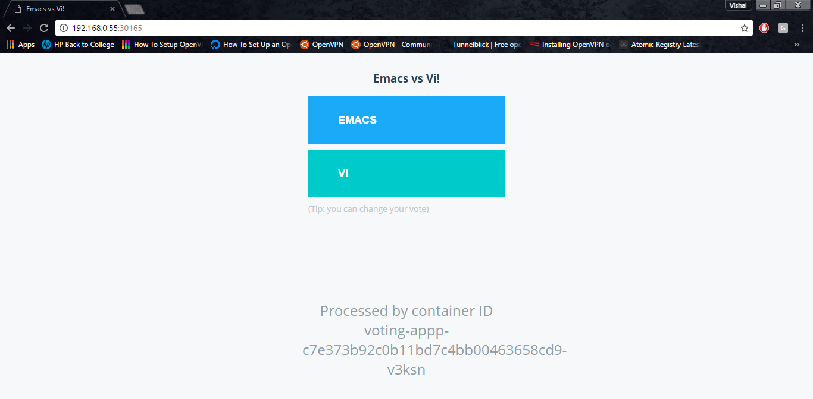

# Rolling Updates and Zero Downtime Deployments

A rolling update works by:
1. Creating a new replication controller with the updated configuration.
2. Increasing/decreasing the replica count on the new and old controllers until the correct number of replicas is reachedor by updating the version of the pod which is running.


#### Rolling updates with RCs

Now we can see in the RC yaml file that the pods are running with the version of image : schoolofdevops/vote:latest.

Lets try upgrading our pods to the version schoolofdevops/vote:movies without deleting the RC or the pods.

That's how the rolling updates helps in Kubernetes.

To do so:
```
kubectl rolling-update vote-rc --update-period=20s --image=schoolofdevops/vote:movies
```
Sample Output:
```
kubectl rolling-update voting-appp --image=venkatsudharsanam/votingapp-python:10.0.0
Created voting-appp-c7e373b92c0b11bd7c4bb00463658cd9
Scaling up voting-appp-c7e373b92c0b11bd7c4bb00463658cd9 from 0 to 1, scaling down voting-appp from 1 to 0 (keep 1 pods available, don't exceed 2 pods)
Scaling voting-appp-c7e373b92c0b11bd7c4bb00463658cd9 up to 1
Scaling voting-appp down to 0
Update succeeded. Deleting old controller: voting-appp
Renaming voting-appp to voting-appp-c7e373b92c0b11bd7c4bb00463658cd9
replicationcontroller "voting-appp" rolling updated
```

Now go to the browser and reload the page, you will see the below output:




Thus the Rolling Update is successfull.


#### Rollback (does this work? )
We can also rollback current update in progress by running:

```
kubectl rolling-update vote-rc --rollback
```

#### Deleting the RC:

To delete a replication controller as well as the pods that it controls, use

```
kubectl delete rc vote-rc
```
