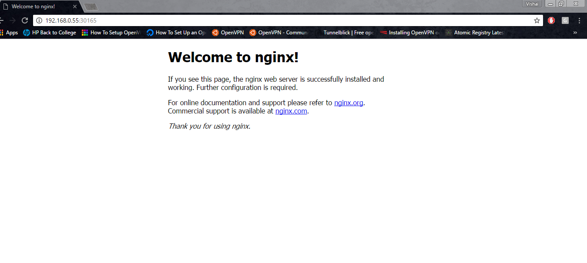

# Rolling Updates with Deployments

A rolling update works by:
1. Creating a new replication controller with the updated configuration.
2. Increasing/decreasing the replica count on the new and old controllers until the correct number of replicas is reachedor by updating the version of the pod which is running.

### Creating a Deployment

Create a yaml file for the deployment.

We already have a yaml file to create a deployment "vote_dep.yaml"
Now create the Deployment
```
kubectl create -f vote_dep.yaml --record
```

Now the deployment is created. To check it,

```
kubectl get deployment
```
Sample Output
```
kubectl get deployment
NAME          DESIRED   CURRENT   UP-TO-DATE   AVAILABLE   AGE
voting-appp   1         1         1            1           19s
```

#### Creating a Service for it


Now to create a service:

```
kubectl create -f voting-app-service.yaml --record
```

Sample Output:
```
kubectl create -f voting-app-service.yaml --record
service "voting-appp" created
```

Now to check which port the pod is connected
```
kubectl describe service voting-appp
```
Check for the Nodeport here

Sample Output
```
kubectl describe service voting-appp
Name:                   voting-appp
Namespace:              default
Labels:                 run=voting-appp
Selector:               run=voting-appp
Type:                   LoadBalancer
IP:                     10.107.126.18
Port:                   <unset> 80/TCP
NodePort:               <unset> 30410/TCP
Endpoints:              10.40.0.23:80
Session Affinity:       None
No events.
```

Go to browser and check hostip:NodePort

Here the node port is 30410.

Sample output will be:




#### Rolling update

Now we can see in the RC yaml file that the pods are running with the version of image : venkatsudharsanam/votingapp-python:8.0.0.

Lets try upgrading our pods to the version venkatsudharsanam/votingapp-python:10.0.0 without deleting the RC or the pods.
That's how the rolling updates helps in Kubernetes.


Create a new file

```
vi voting-app-deployment1.yaml
```
Now paste the below line in the yaml file

```
apiVersion: extensions/v1beta1
kind: Deployment
metadata:
  labels:
    run: voting-appp
  name: voting-appp
  namespace: default
spec:
  replicas: 1
  template:
    metadata:
      labels:
        run: voting-appp
    spec:
      containers:
      - image: venkatsudharsanam/votingapp-python:10.0.0
        imagePullPolicy: Always
        name: voting-appp
        ports:
        - containerPort: 80
          protocol: TCP
      dnsPolicy: ClusterFirst
      restartPolicy: Always
      securityContext: {}
```

And save the file.

Now to Roll out our update:

```
kubectl apply -f voting-app-deployment1.yaml --record
```

Now go to the browser and reload the page. You will see the below output:


Now delete all the deployment and services
